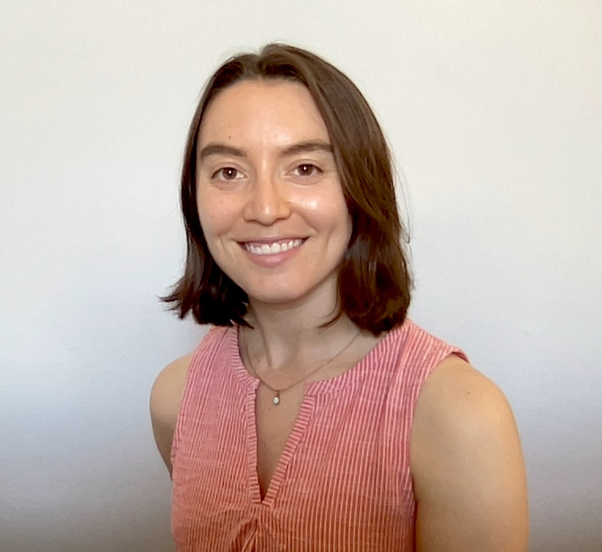

# About Me 

My name is Elise Newman and I am an assistant professor at MIT Linguistics. I work primarily on syntax, with additional interests in semantics/pragmatics and first language acquisition. I finished my PhD at MIT in 2021, and more recently was a postdoc at the University of Edinburgh, where I collaborated with researchers from Edinburgh, Goettingen, and Stonybrook on a project about syntactic locality effects. You can find out more about my work in the "Research" section. Outside of being a linguist, I enjoy soccer, ceramics, and hiking/cycling.

